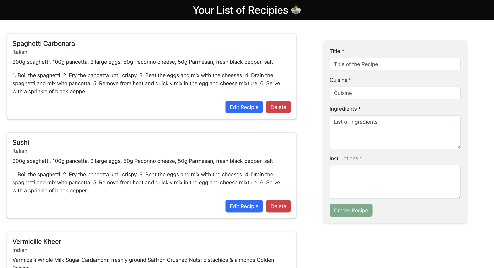

# Roulettech_frontend

# Project Description

This project is a frontend application built using React. It provides a user interface for a recipe sharing app. Users can add, update, view, delete recipies

# UI

## Available Scripts

In the project directory, you can run:

### `npm start`

Runs the app in the development mode.\
Open [http://localhost:3000](http://localhost:3000) to view it in your browser.

The page will reload when you make changes.\
You may also see any lint errors in the console.

### `npm test`

Launches the test runner in the interactive watch mode.\
See the section about [running tests](https://facebook.github.io/create-react-app/docs/running-tests) for more information.

### `npm run build`

Builds the app for production to the `build` folder.\
It correctly bundles React in production mode and optimizes the build for the best performance.

## License

This project is licensed under the [MIT License](LICENSE).

## Author

[Varun Bharathi Jayakumar](https://github.com/varun-jayakumar) 👋
